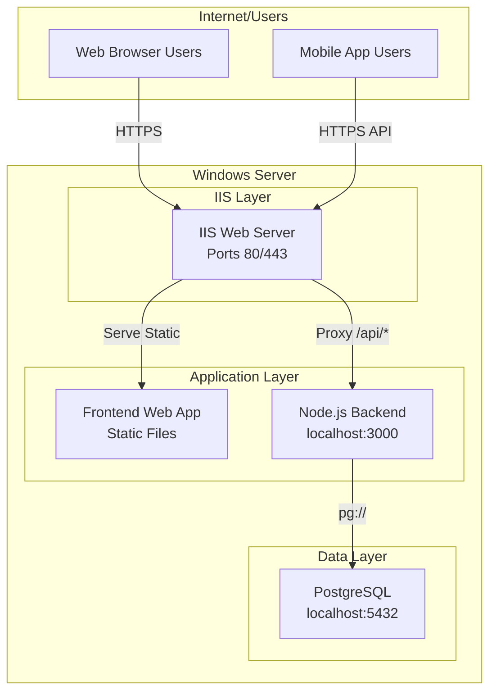
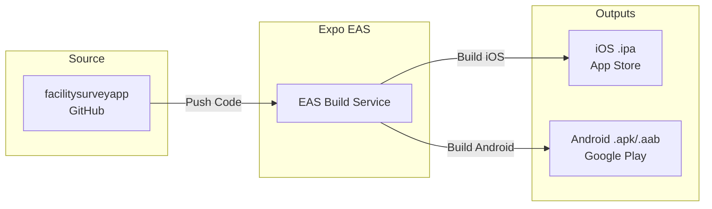

# SOC Survey App - Production Deployment Plan for IIS

## Executive Summary

This document outlines a comprehensive production deployment plan for the SOC Survey Application on a single Windows Server using IIS. The application consists of:

- **Web Frontend**: React Native Web (built with Expo)
- **Backend API**: Node.js/Express with TypeScript
- **Database**: PostgreSQL
- **Mobile Apps**: iOS and Android (via Expo EAS Build)

---

## 1. System Architecture

### 1.1 Single-Server Deployment Architecture



### 1.2 Network Flow

| Component | Port | Protocol | Purpose | Exposure |
|-----------|------|----------|---------|----------|
| IIS HTTP | 80 | HTTP | Redirect to HTTPS | Public |
| IIS HTTPS | 443 | HTTPS | Web App + API | Public |
| PostgreSQL | 5432 | TCP | Database | localhost only |
| Node.js Backend | 3000 | HTTP | API | localhost only |

---

## 2. Prerequisites and Server Requirements

### 2.1 Windows Server Requirements

- **OS**: Windows Server 2019 or Windows Server 2022
- **RAM**: Minimum 8GB (16GB recommended)
- **CPU**: 4 cores minimum
- **Disk**: 100GB SSD minimum
- **IIS** with URL Rewrite Module and Application Request Routing (ARR)

### 2.2 Required Software

| Software | Version | Purpose |
|----------|---------|---------|
| Node.js | 18.x LTS or 20.x LTS | Backend runtime |
| PostgreSQL | 14.x or 16.x | Database |
| IIS | Built-in | Web server |
| URL Rewrite | Latest | URL routing |
| Application Request Routing | Latest | Reverse proxy |

### 2.3 Required Windows Features

```powershell
# Enable required Windows features
Enable-WindowsOptionalFeature -Online -FeatureName IIS-WebServer
Enable-WindowsOptionalFeature -Online -FeatureName IIS-WebServerRole
Enable-WindowsOptionalFeature -Online -FeatureName IIS-StaticContent
Enable-WindowsOptionalFeature -Online -FeatureName IIS-DefaultDocument
Enable-WindowsOptionalFeature -Online -FeatureName IIS-HttpRedirect
Enable-WindowsOptionalFeature -Online -FeatureName IIS-HttpLogging
Enable-WindowsOptionalFeature -Online -FeatureName IIS-HealthAndDiagnostics
Enable-WindowsOptionalFeature -Online -FeatureName IIS-Security
```

---

## 3. Database Setup

### 3.1 PostgreSQL Installation

```powershell
# Download and install PostgreSQL
# Recommended: Use EnterpriseDB installer or Chocolatey

choco install postgresql --version=16.1 -y
```

### 3.2 Database Configuration

1. **Initialize PostgreSQL data directory**
2. **Create database and user**

```sql
-- Run in psql as postgres user
CREATE DATABASE facility_survey_db;
CREATE USER facility_user WITH PASSWORD 'your_strong_password';
GRANT ALL PRIVILEGES ON DATABASE facility_survey_db TO facility_user;

-- Connect to facility_survey_db and run schema
\c facility_survey_db;
-- Execute backend/schema.sql contents here
```

### 3.3 Environment Variables

Create `backend/.env` file:

```env
NODE_ENV=production
PORT=3000

# Database
DB_HOST=localhost
DB_PORT=5432
DB_NAME=facility_survey_db
DB_USER=facility_user
DB_PASSWORD=your_strong_password

# Security
JWT_SECRET=your_32_character_minimum_secret_key_here
JWT_EXPIRES_IN=1h

# CORS (your domain)
ALLOWED_ORIGINS=https://your-domain.com,https://www.your-domain.com
```

---

## 4. Backend Deployment

### 4.1 Build Backend

```powershell
# Navigate to backend directory
cd backend

# Install dependencies
npm install

# Build TypeScript
npm run build
```

### 4.2 Run as Windows Service

Use NSSM (Non-Sucking Service Manager) to run Node.js as a Windows Service:

```powershell
# Install NSSM
choco install nssm -y

# Create service
nssm install FacilitySurveyBackend "C:\Program Files\nodejs\node.exe"
nssm set FacilitySurveyBackend AppDirectory "C:\WebApps\facility-backend"
nssm set FacilitySurveyBackend AppParameters "dist/server.js"
nssm set FacilitySurveyBackend DisplayName "Facility Survey Backend"
nssm set FacilitySurveyBackend Description "Backend API for Facility Survey Application"
nssm set FacilitySurveyBackend Start SERVICE_AUTO_START

# Create logs directory
New-Item -ItemType Directory -Force -Path "C:\WebApps\facility-backend\logs"

# Start service
nssm start FacilitySurveyBackend
```

### 4.3 Backend Health Check

```powershell
# Test backend is running
Invoke-RestMethod -Uri "http://localhost:3000/health"
```

Expected response:
```json
{
  "status": "ok",
  "timestamp": "2024-01-01T00:00:00.000Z"
}
```

---

## 5. Frontend Web Deployment

### 5.1 Build Frontend for Web

```powershell
# Navigate to frontend directory
cd FacilitySurveyApp

# Install dependencies
npm install

# Build for web
npx expo export --platform web
```

This creates a `dist` folder with static web files.

### 5.2 Deploy to IIS

```powershell
# Copy built files to IIS web root
$FrontendPath = "C:\inetpub\wwwroot\facility-survey"
New-Item -ItemType Directory -Force -Path $FrontendPath
Copy-Item -Path ".\dist\*" -Destination $FrontendPath -Recurse -Force

# Copy web.config
Copy-Item -Path ".\IIS_web.config" -Destination "$FrontendPath\web.config"
```

### 5.3 Configure IIS Website

1. Open **IIS Manager**
2. Add new website:
   - **Site name**: FacilitySurvey
   - **Physical path**: `C:\inetpub\wwwroot\facility-survey`
   - **Binding**: HTTPS on port 443
   - **SSL Certificate**: Import your SSL certificate

3. Add HTTP binding on port 80 (redirects to HTTPS)

---

## 6. IIS Configuration

### 6.1 URL Rewrite Rules

The existing `IIS_web.config` already includes:

| Rule | Purpose |
|------|---------|
| HTTP → HTTPS | Redirect all HTTP to HTTPS |
| API Proxy | Rewrite `/api/*` to backend |
| Health Check | Proxy `/health` to backend |
| Static Files | Serve existing files directly |
| SPA Routing | Serve `index.html` for SPA routes |

### 6.2 Security Headers

The configuration includes:
- `X-Frame-Options: SAMEORIGIN`
- `X-Content-Type-Options: nosniff`
- `X-XSS-Protection: 1; mode=block`
- `Referrer-Policy: strict-origin-when-cross-origin`

### 6.3 CORS Configuration

Backend CORS should allow your production domain:

```typescript
// backend/src/server.ts
app.use(cors({
  origin: ['https://your-domain.com'],
  credentials: true
}));
```

---

## 7. Mobile App Deployment

### 7.1 Build Strategy

For mobile apps, you need to build native binaries:



### 7.2 Expo EAS Build Steps

1. **Configure app.json/eas.json**

```json
{
  "expo": {
    "name": "SOC Survey",
    "slug": "soc-survey-app",
    "ios": {
      "bundleIdentifier": "com.yourcompany.socsurvey",
      "icon": "./assets/icon.png"
    },
    "android": {
      "package": "com.yourcompany.socsurvey",
      "icon": "./assets/icon.png"
    }
  }
}
```

2. **Install EAS CLI**
```bash
npm install -g eas-cli
```

3. **Configure API URL for mobile**
```typescript
// Update in FacilitySurveyApp/src/services/api.ts
const baseURL = 'https://your-domain.com/api';
```

4. **Build for stores**
```bash
eas build -p ios
eas build -p android
```

### 7.3 Update Mobile API Endpoint

In `FacilitySurveyApp/src/services/api.ts`, change:

```typescript
// Production API URL
const baseURL = 'https://your-domain.com/api';
```

---

## 8. SSL/TLS Configuration

### 8.1 Obtain SSL Certificate

Options:
1. **Let's Encrypt** (free) - Use `win-acme` software
2. **Buy from CA** - DigiCert, Comodo, etc.
3. **Internal CA** - For internal apps

### 8.2 Install SSL Certificate

```powershell
# Import certificate to IIS
Import-PfxCertificate -FilePath "your-certificate.pfx" `
    -CertStoreLocation Cert:\LocalMachine\My `
    -Password (ConvertTo-SecureString "your-password" -AsPlainText)
```

### 8.3 Bind SSL to Website

In IIS Manager:
1. Select website → **Bindings** → **Add**
2. Type: `https`
3. Port: `443`
4. SSL Certificate: Select your certificate

---

## 9. Security Checklist

- [ ] Change default admin password
- [ ] Use strong JWT secret (32+ characters)
- [ ] Enable HTTPS/SSL
- [ ] Configure firewall (only ports 80/443 open)
- [ ] Enable database backups
- [ ] Set up monitoring/alerts
- [ ] Use environment variables (never commit secrets)
- [ ] Enable rate limiting on API
- [ ] Configure CORS properly
- [ ] Keep dependencies updated
- [ ] Enable Windows security updates

---

## 10. Monitoring and Maintenance

### 10.1 Logging

| Component | Log Location |
|-----------|--------------|
| IIS | `%SystemDrive%\inetpub\logs\LogFiles\` |
| Backend | `C:\WebApps\facility-backend\logs\` |
| Windows Event Viewer | Application Logs |

### 10.2 Health Monitoring

- Set up URL monitoring (UptimeRobot, Pingdom)
- Monitor `/health` endpoint
- Set up alerts for downtime

### 10.3 Backup Strategy

```powershell
# Database backup script
$backupFile = "facility_survey_backup_$(Get-Date -Format 'yyyyMMdd_HHmmss').sql"
pg_dump -h localhost -U facility_user facility_survey_db > $backupFile
```

Recommended:
- Daily automated backups
- Weekly full backups
- Monthly offsite backup
- Test restore quarterly

---

## 11. Deployment Checklist

### Pre-Deployment
- [ ] Windows Server provisioned
- [ ] IIS installed with URL Rewrite and ARR
- [ ] Node.js installed
- [ ] PostgreSQL installed
- [ ] SSL certificate obtained

### Database
- [ ] PostgreSQL service running
- [ ] Database created
- [ ] User permissions configured
- [ ] Schema imported

### Backend
- [ ] Dependencies installed
- [ ] TypeScript compiled
- [ ] Environment variables configured
- [ ] Windows Service created and running
- [ ] Health check passing

### Frontend Web
- [ ] Expo web build completed
- [ ] Files copied to IIS directory
- [ ] web.config deployed
- [ ] IIS website configured
- [ ] SSL bound

### Mobile
- [ ] API URL updated in source
- [ ] EAS build configured
- [ ] iOS build submitted to App Store
- [ ] Android build submitted to Play Store

### Production
- [ ] DNS configured
- [ ] SSL working
- [ ] HTTPS redirect working
- [ ] API responding
- [ ] Web app loading
- [ ] Mobile app connecting
- [ ] Monitoring configured

---

## 12. Rollback Procedure

If deployment fails:

1. **Stop IIS website**
2. **Stop backend service**: `nssm stop FacilitySurveyBackend`
3. **Restore previous backend files**
4. **Restore previous frontend files**
5. **Restart services**
6. **Verify health endpoints**

---

## 13. Support Contacts

| Role | Contact |
|------|---------|
| System Administrator | [Your IT Admin] |
| Database Administrator | [Your DBA] |
| Application Developer | [Your Developer] |
| Security Team | [Your Security Team] |

---

## Appendix A: Directory Structure

```
C:\
├── inetpub\
│   └── wwwroot\
│       └── facility-survey\          # Frontend web files
│           ├── index.html
│           ├── static\
│           └── web.config
├── WebApps\
│   └── facility-backend\            # Backend application
│       ├── dist\                     # Compiled JavaScript
│       ├── logs\                     # Service logs
│       ├── node_modules\
│       └── .env                      # Environment variables
├── Program Files\
│   └── PostgreSQL\                   # Database
```

---

## Appendix B: Key Endpoints

| Endpoint | Purpose |
|----------|---------|
| `https://your-domain.com` | Web Application |
| `https://your-domain.com/api/auth/login` | Login |
| `https://your-domain.com/api/health` | Health Check |
| `https://your-domain.com/api/users` | User Management |
| `https://your-domain.com/api/surveys` | Survey CRUD |

---

*Document Version: 1.0*
*Last Updated: 2026-03-12*
